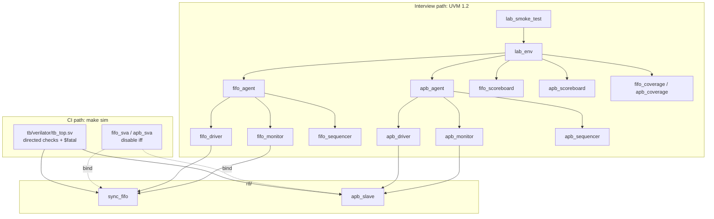

# uvm-fifo-apb-lab

Public teaching lab: a **synchronous FIFO** and a **simple APB3-style slave**,
with a UVM 1.2-shaped class testbench for interviews and a slim Verilator
testbench that actually runs in CI.

Author: Bharath Posina.

This repository is **PUBLIC-SAFE**. Textbook names and widths only. No Micron,
NAND, UFS, proprietary register maps, vendor VIP, or unsanitized logs.

Companion conventions: [claude-dv-kit](https://github.com/bharathposina60-rgb/claude-dv-kit).

## What it is

Two DUTs, two testbenches, one Makefile:

| Path | Role | Runs in GitHub Actions? |
| --- | --- | --- |
| `rtl/sync_fifo.sv` | Parameterized sync FIFO (`WIDTH=8`, `DEPTH=16`) | yes (as DUT) |
| `rtl/apb_slave.sv` | 16 × 32 APB3-style slave, 0-wait `PREADY` | yes (as DUT) |
| `tb/verilator/` | Directed / constrained-lite SV TB + SVA | **yes** — `make sim` |
| `tb/uvm/` | Full UVM 1.2 class TB (item … test) | **no** — needs `uvm_pkg` + commercial/compatible sim |

Verilator cannot run Accellera UVM well. CI therefore never compiles `tb/uvm`.
That tree is the interview artifact: same DUT, same protocol, real UVM 1.2
shapes (`sequence_item`, sequencer, driver, monitor, agent, env, scoreboard,
named-bin covergroups, test). See [tb/uvm/README.md](tb/uvm/README.md).

## Architecture



ASCII equivalent:

```
  lab_smoke_test                          tb/verilator/tb_top.sv
          |                                        |
       lab_env                                     |
     /    |     \                                  |
 fifo_ag apb_ag  scoreboard+covergroups            |
   |        |                                      |
 driver/  driver/                                  |
 monitor  monitor                                  |
   |        |                                      |
   +---- rtl/sync_fifo  rtl/apb_slave -------------+
                    ^
                    bind fifo_sva / apb_sva
```

## How to run CI sim

Needs Verilator 5.x (`--binary`, `--timing`, `--assert`). Ubuntu 24.04+
`apt-get install verilator g++ make` is enough. No VCS, Xcelium, or Questa.

```bash
make sim          # self-checking; non-zero exit on $error/$fatal
make waves        # same + waves.vcd  (+trace)
make lint         # Verilator --lint-only on each DUT
make clean
```

Seed (printed at time 0, used by random FIFO traffic):

```bash
make sim PLUSARGS=+seed=1
```

GitHub Actions (`.github/workflows/sim.yml`) installs Verilator from apt and
runs `make sim` on every push and pull request.

## UVM 1.2 mapping

| UVM 1.2 | This lab |
| --- | --- |
| `uvm_sequence_item` | `fifo_item`, `apb_item` |
| `uvm_sequencer #(REQ)` | `fifo_sequencer`, `apb_sequencer` |
| `uvm_driver #(REQ)` | `fifo_driver`, `apb_driver` |
| `uvm_monitor` | `fifo_monitor`, `apb_monitor` |
| `uvm_agent` + `is_active` | `fifo_agent`, `apb_agent` |
| `uvm_env` | `lab_env` |
| `uvm_scoreboard` | `fifo_scoreboard`, `apb_scoreboard` |
| covergroup, named bins | `fifo_coverage`, `apb_coverage` |
| `uvm_test` + objections | `lab_smoke_test`, `fifo_fill_empty_test`, `apb_mem_test` |

Compile with `+define+UVM` and a UVM 1.2 library. Example file list:
`tb/uvm/filelist.f`. Default test is `lab_smoke_test`.

## DUT cheat sheet

**sync_fifo** — `clk`, `rst_n`, `wr_en`, `rd_en`, `wdata`, `rdata`, `full`,
`empty`, plus `count`. Writes while full and reads while empty are ignored.
`rdata` is registered (not FWFT). Simultaneous wr+rd when neither full nor
empty leaves occupancy unchanged.

**apb_slave** — `PCLK`, `PRESETn`, `PSEL`, `PENABLE`, `PWRITE`, `PADDR`,
`PWDATA`, `PRDATA`, `PREADY`, `PSLVERR`. 16 words × 32 bits, byte addresses,
word-aligned (`PADDR[5:2]`). `PREADY` tied 1 (zero wait). Out-of-range
`PADDR[7:6] != 0` sets `PSLVERR` and does not write.

## Debug writeup

[docs/debug-note.md](docs/debug-note.md) is a real off-by-one on `full`
(`count == DEPTH-1` vs `DEPTH`): symptom, the debug order (clocks, reset,
objections/drain, seed), and the directed test that caught it. The fix is
in RTL; the old comparison is called out in a comment so it is not
re-introduced.

## Public-safe rule

Refuse or rewrite anything that would leak product IP. Substitute generic
FIFO / APB / CDC / arbiter examples with textbook widths (8/16/32). This
lab is the worked example of that rule.

License: MIT. Copyright (c) 2026 Bharath Posina.
